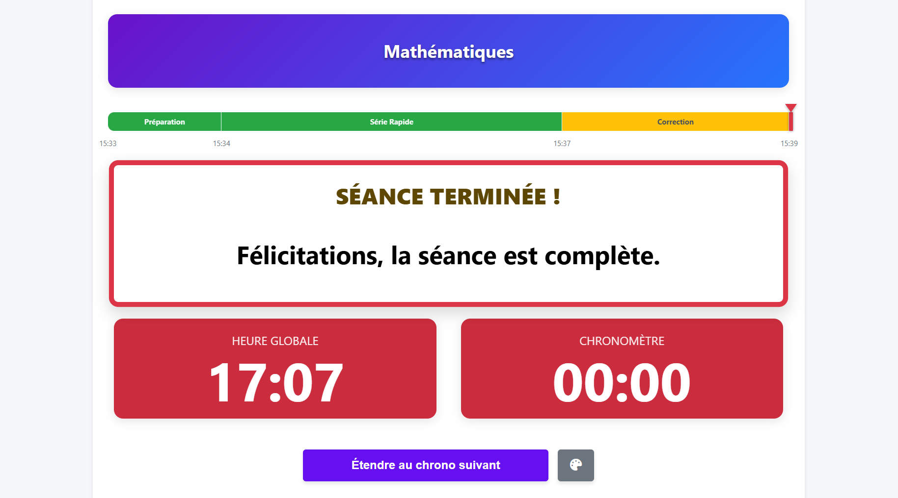
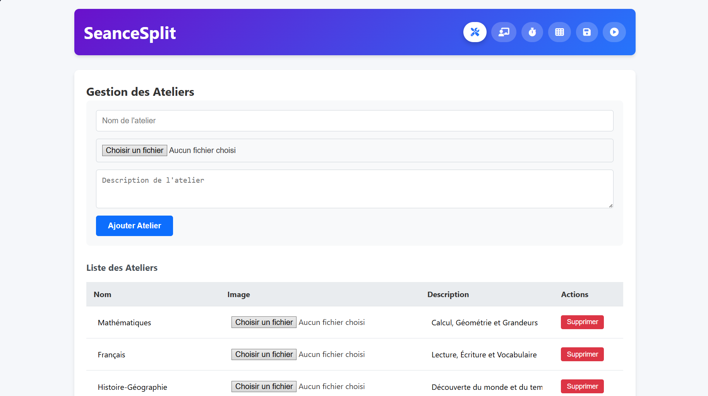
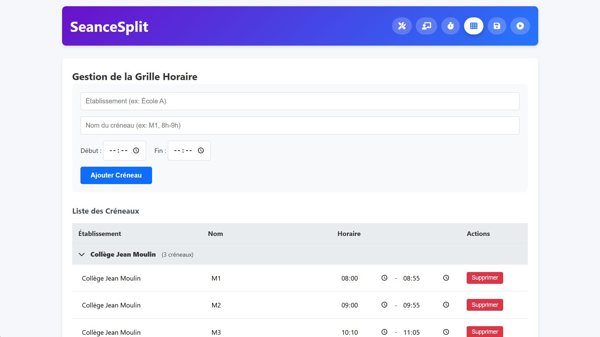

# Application de Gestion des Chronomètres de Séances Pédagogiques

Cette application permet de découper vos séances de cours en plusieurs chronomètres avec les travaux à effectuer dans chaque intervalle de temps. Elle propose une gestion complète des ateliers, séances et chronomètres.

## Aperçu

## Fonctionnalités

- **Gestion des Ateliers** : Créez et gérez vos ateliers pédagogiques
- **Gestion des Séances** : Créez des séances liées à des ateliers
- **Gestion des Chronomètres** : Ajoutez des chronomètres avec durée et travail à effectuer à chaque séance
- **Gestion de la Grille Horaire** : Définissez des créneaux horaires, compatible multi-établissements
- **Visualisation des Séances** : Lancez une séance avec tous ses chronomètres et suivez leur progression
- **Organisation Optimisée** : Listes regroupées et dépliables (Chronomètres par séance, Créneaux par établissement)
- **Sauvegarde et Démo** : Import/Export de données, mode Démo pour tester, et Reset pour tout effacer

## Structure de l'Application

L'application est divisée en plusieurs sections principales :

1. **Gestion Ateliers** : Création et gestion des ateliers
2. **Gestion Séances** : Création de séances liées aux ateliers existants
3. **Gestion Chronomètres** : Création de chronomètres liés aux séances existantes
4. **Gestion Grille** : Configuration des horaires de sonnerie/cours par établissement
5. **Sauvegarde** : Import/Export JSON, chargement de données de démonstration et réinitialisation
6. **Visualisation Séances** : Interface pour lancer et suivre une séance en temps réel

## Comment Utiliser l'Application

1. Commencez par créer des ateliers via la section "Gestion Ateliers"
2. Créez ensuite des séances liées à ces ateliers via "Gestion Séances"
3. Ajoutez des chronomètres à vos séances via "Gestion Chronomètres"
4. (Optionnel) Configurez votre grille horaire dans "Gestion Grille"
5. Utilisez "Visualisation Séances" pour lancer une séance et suivre les chronomètres en temps réel. Vous pouvez aligner la fin de séance sur un créneau de la grille.

## Contrôles de la Séance

- **Démarrer/Pause** : Démarre ou met en pause le chronomètre actuel
- **Suivant** : Passe au chronomètre suivant
- **Réinitialiser** : Remet la séance au début

## Données Sauvegardées

Toutes les données sont sauvegardées localement dans votre navigateur, elles restent donc disponibles après avoir fermé et rouvert la page.

## Technologies Utilisées

- HTML5
- CSS3
- JavaScript (ES6)
- LocalStorage pour la persistance des données

## Fichiers

- `index.html` : La structure principale de l'application
- `styles.css` : Les styles et design de l'application
- `app.js` : La logique métier et les fonctionnalités JavaScript
